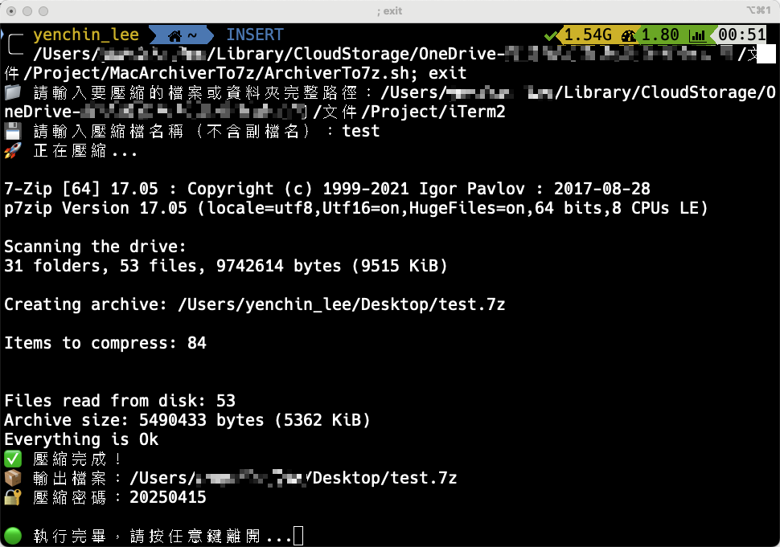

# 📦 壓縮小工具（Bash Script）

這是一個簡易的 Bash 壓縮腳本，可將指定的檔案或資料夾壓縮為 `.7z` 檔案，並自動設定當天日期為壓縮密碼，將壓縮檔輸出到桌面。

---

## 🔧 功能簡介

- ✅ 壓縮任意檔案或資料夾
- ✅ 自動輸出至使用者桌面
- ✅ 壓縮檔名自訂
- ✅ 密碼自動設定為執行當天的日期（格式為 `yyyyMMdd`）
- ✅ 密碼加密與隱藏檔名功能（`-mhe=on`）

---


## 🛠️ 系統需求

已安裝 7z 壓縮工具（通常可透過以下方式安裝）：

**Ubuntu / Debian 系統：**
```bash
sudo apt install p7zip-full
```
**Mac（使用 Homebrew）：**
```bash
brew install p7zip
```

## 📁 使用方法

1. **開啟終端機**
2. **執行腳本：**
   ```bash
   ./compress.sh
    ```
3. **依照指示輸入以下資訊：**
- 要壓縮的檔案或資料夾的完整路徑
- 輸出的壓縮檔名稱（不需副檔名）
4. **完成後會顯示：**
- 壓縮檔位置（預設位於桌面）
- 自動產生的壓縮密碼（預設當日日期）

## 📝 測試結果
